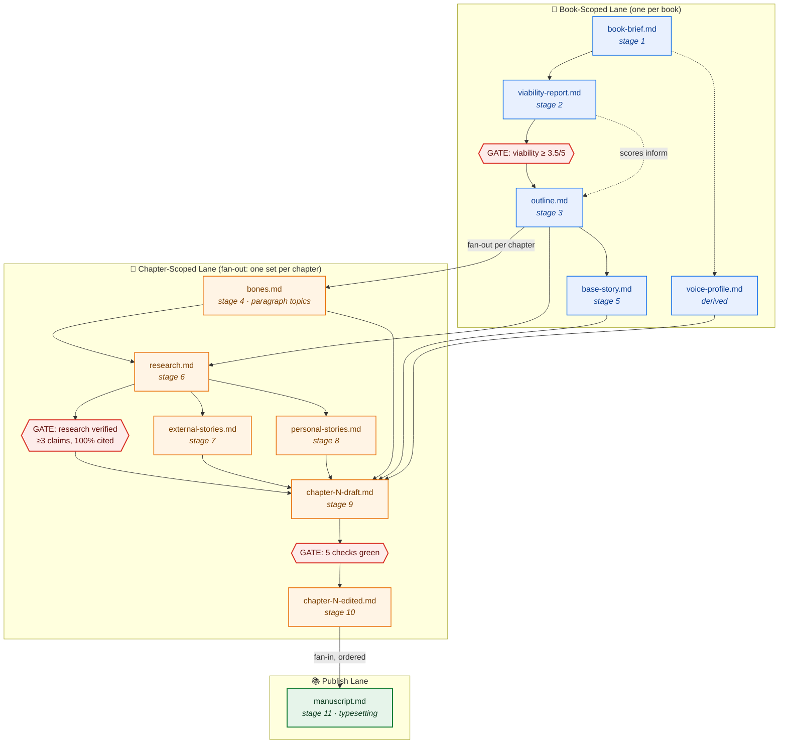

# GHOSTWRITR Artifact Flow

The book-to-manuscript pipeline renders as two lanes (book-scoped and chapter-scoped) plus a terminal publish lane. Three hard gates block advancement.

## Swim-Lane Diagram

## Legend

- **Blue** — book-scoped artifact (written once, read many).
- **Orange** — chapter-scoped artifact (instantiated per chapter; diagram shows one lane but it fans out N times for a book with N chapters).
- **Red diamonds** — hard gates. Three of them:
  1. **Viability** before outline (stage 2 → stage 3). Score must clear 3.5/5 or override.
  2. **Research verified** before drafting (stage 6 → stage 9). ≥3 claims, 100% cited.
  3. **Five checks green** before editorial (stage 9 → stage 10). Word count, sources present, framework slots filled, voice critic ≥3.5/5, no unverified claims.
- **Green** — terminal artifact (manuscript outputs).
- **Dotted line** — advisory relationship (viability scores inform outline but don't gate it).
- **Solid line** — mandatory flow.

## Artifact Format Reference

See `ghostwritr.manifest.yaml` for per-stage format decisions (Markdown + frontmatter vs. Markdown + `.data.json` sibling). Rule of thumb: if a later stage reads structured fields programmatically, commit a JSON sibling. Otherwise, prose-in-Markdown-out.
