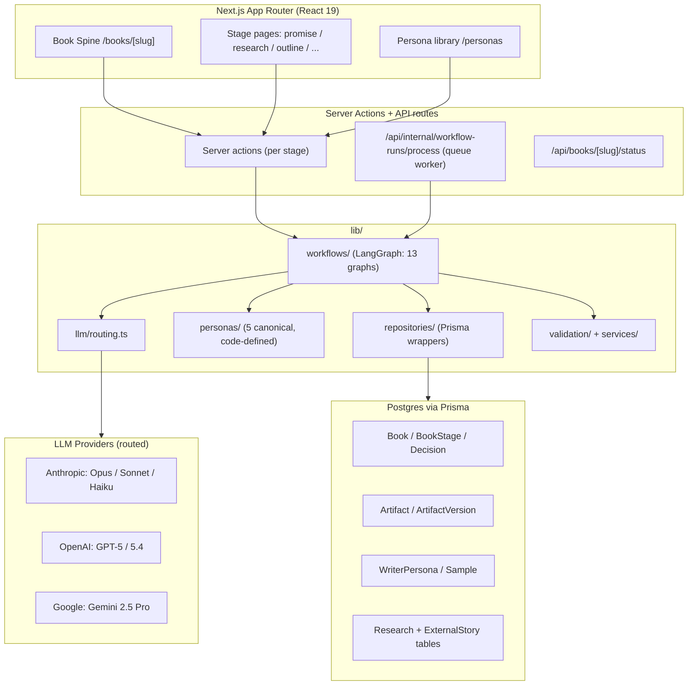

# GHOSTWRITR — Architecture

**Status:** Current-state + target-state + migration path
**Author:** Winston (System Architect)
**Date:** 2026-04-20

---

## 1. System Overview

### 1.1 What GHOSTWRITR is (architecturally)

GHOSTWRITR is a **stage-gated, agent-orchestrated book production system**. Architecturally, it is three things glued together:

1. **A stateful pipeline** — eleven stages, per-book status, artifact versioning, and human-in-the-loop gates.
2. **An LLM router** — a cost-disciplined dispatcher that sends each sub-task to the cheapest model that can do it well, across Anthropic, OpenAI, and Google.
3. **A voice engine** — canonical writer personas compiled into code, blended by percentage, and projected into every authoring prompt.

It is **not** a chatbot. It is **not** a CMS. It is a workflow engine whose unit of work is "one book chapter, with a verifiable voice and verifiable facts."

### 1.2 Design principles (what the architecture defends)

- **Boring technology where possible.** Next.js App Router, Postgres, Prisma. No bespoke infra.
- **One source of truth per concern.** Personas live in code; artifacts live in the DB; routing lives in env vars. Each concern has exactly one home.
- **Gates are first-class.** Every stage produces an artifact; every artifact is reviewed; every commit is versioned. Nothing advances silently.
- **Cost discipline is a design constraint, not an afterthought.** The router is in the architecture, not in application code.
- **Solo-ergonomic, team-extensible.** The system must be runnable by one person today and auditable by a team tomorrow.
- **User journeys drive technical decisions.** The spine view (Promise → Chapter) is the real product surface; the database is scaffolding for it.

### 1.3 Architecture diagram



---

## 2. Current State

### 2.1 Tech stack

| Layer              | Choice                                              | Version            | Notes                                           |
| ------------------ | --------------------------------------------------- | ------------------ | ----------------------------------------------- |
| Runtime / router   | Next.js App Router                                  | 16.2.1             | Turbopack dev, server actions enabled           |
| Language           | TypeScript                                          | 6.0 strict, ES2017 | Path alias `@/*` → `./src/*`                    |
| UI                 | React                                               | 19.2               |                                                 |
| Database           | PostgreSQL via Prisma                               | 6.16 / 6.19        | Schema drift present; team uses `db push`       |
| Orchestration      | LangGraph                                           | 1.2.6              | 13 workflow graphs in `src/lib/workflows`       |
| LLM SDKs           | `@langchain/anthropic` / `openai` / `google-genai`  | 1.0 / 1.3 / 1.0    |                                                 |
| Validation         | Zod                                                 | 4.3                | Used for artifact shapes + LLM structured output |
| Doc extraction     | `mammoth`, `pdfjs-dist`                             | latest             | DOCX + PDF ingestion                             |
| Testing            | —                                                   | none               | `tsc --noEmit` is the only gate                  |
| Lint / format      | Next.js defaults                                    | —                  | No explicit ESLint / Prettier config             |

### 2.2 Application structure

```
src/
├── app/                              # Next.js routes (UI + server actions + API)
│   ├── books/[slug]/                 # Per-book stage pages
│   │   ├── promise/  research/  outline/  setup/ ...
│   │   └── (spine view lives here; not yet implemented)
│   ├── api/internal/workflow-runs/   # Async queue worker endpoint
│   ├── api/books/[slug]/             # Status + export
│   ├── personas/                     # Persona library UI
│   └── components/                   # Shared React components
├── lib/
│   ├── workflows/                    # 13 LangGraph graphs (the orchestration core)
│   ├── repositories/                 # Prisma wrappers — the DB boundary
│   ├── personas/                     # Canonical persona source (NEW this session)
│   ├── llm/routing.ts                # LLM_<STAGE>_<ROLE> → provider:model
│   ├── validation/                   # Promise validation + scoring engines
│   ├── services/                     # Knowledge base + document extraction
│   ├── db.ts                         # Prisma client + retry wrapper
│   └── stages.ts                     # StageKey enum + artifact type map
├── prisma/
│   ├── schema.prisma                 # 25+ models, 26+ enums
│   ├── migrations/                   # 3 migrations; DB has drifted via `db push`
│   └── seed-framework-flows.ts       # Seeds canonical framework flows
└── reference-library/personas/       # Voice sample files (non-canonical)
```

**Rule of thumb:** UI asks server actions; server actions call workflows; workflows call repositories and routed LLMs. No component reaches directly into Prisma. No workflow reaches directly into `fetch()` against a provider — it goes through the router.

### 2.3 Data model (25+ Prisma models grouped by domain)

- **Book identity & status** — `Book`, `BookStage`, `Decision`, `WorkflowRun`
- **Content artifacts** — `Artifact`, `ArtifactVersion` (26+ `ArtifactType` enum values: `PROMISE_BRIEF`, `PERSONA_PACK`, `MARKET_REPORT`, `OUTLINE`, `CHAPTER_DRAFT`, etc.)
- **Author identity & voice** — `AuthorProfile`, `WriterPersona`, `WriterPersonaSample`
- **Source material** — `SourceDocument`
- **Research pipeline** — `ResearchSource`, `ResearchItem`, `ResearchVerification`
- **External stories pipeline** — `ExternalStoryBinderTab`, `ExternalStoryClip`, `ExternalStoryItem`, `ExternalStoryVerification`

The shape of the model is essentially: **Book has Stages; each Stage produces Artifacts; each Artifact has Versions; each Version has a Decision; some Artifacts have specialized sibling tables (research, stories) for fine-grained querying.**

### 2.4 Pipeline orchestration

The 11-stage pipeline, per the `StageKey` enum:

`BOOK_SETUP → PROMISE → AUDIENCE → MARKET_ANALYSIS → OUTLINE → BASE_STORY → RESEARCH → EXTERNAL_STORIES → PERSONAL_STORIES → CHAPTER_DRAFT → EDITING`

Each stage is implemented as a **LangGraph graph** in `src/lib/workflows/`. Graphs are triggered two ways:

1. **Synchronous** — server action invokes the graph and awaits it (used for short, cheap stages).
2. **Asynchronous** — server action enqueues a `WorkflowRun`; `/api/internal/workflow-runs/process` drains the queue (used for long, expensive stages like research and chapter drafts).

The queue today is just a Postgres table polled by a route handler. That is fine for a solo user and will need revisiting the moment concurrency > 1 matters.

### 2.5 LLM routing strategy

Routing lives in `src/lib/llm/routing.ts` and is driven by env vars of shape `LLM_<STAGE>_<ROLE>=provider:model`. Current discipline:

- **Opus 4.x** — final editorial pass only. Touches every chapter; reserved for polish.
- **Sonnet 4.x** — default drafter (extract, author, enrich).
- **Haiku 4.x** — quality / verification agents (cheap, fast, focused).
- **GPT-5 / 5.4** — web-search research, and voice-guard critic (must be a different family than the author).
- **Gemini 2.5 Pro** — market analysis and other long-context grounding tasks.

The routing module is the **single lever** for cost control. Application code never hard-codes a model.

### 2.6 Voice framework system (just shipped)

- Five canonical personas are defined as **TypeScript code** in `src/lib/personas/`: AndyGPT (ME-WE-TRUTH-YOU-WE), CahnGPT (Mystery → Pattern → Strategy), DruckerGPT (Diagnose → Prioritize → Execute), ElonGPT (First-Principles Demolition), JobsGPT (Old → New).
- `ensureCanonicalWriterPersonas()` syncs the code definitions into the `WriterPersona` table on boot. **The DB is a cache; code is the source.**
- Voice blending works by percentage mix; the **dominant persona** is resolved deterministically and its framework flow is projected into three places:
  1. `suggestWriterPersonas` prompt
  2. `generateVoiceBlendPreview` prompt
  3. `chapter-draft.ts` system prompt
- Verified end-to-end with a 70/30 Drucker/Jobs blend on the `4-pillars` book.
- Schema additions: `WriterPersona.frameworkFlowJson` (`Json` array of `{slot, prompt}`), `WriterPersona.frameworkName` (`String?`).
- Canonical tag: `checkpoint/post-voice-framework` (commits `4195977`, `92446c9`, `99af0de`).

### 2.7 Known debts and gaps

- **Schema drift.** `prisma migrate dev` would force a destructive reset; the team has been using `db push`. Any migration plan must treat prod schema as the source of truth and backfill migrations later.
- **No local `pg_dump`.** Backups are JSON via Node scripts. Fine for dev, not fine if data ever matters to anyone else.
- **No tests.** `tsc --noEmit` is the only automated gate.
- **No observability.** No structured logs, no metrics, no tracing. The only way to see what a workflow did is to re-run it and watch the terminal.
- **Stale template files** — the Andy/Drucker/Elon `.md.template` files in `_bmad-output/` are not loaded at runtime; the framework lives in code constants.
- **Hardcoded literals previously leaked into prompts** (the "Lean Labs" references in `chapter-draft.ts`, removed this session). Indicates a need for prompt-template discipline.
- **No agent abstraction** — workflows speak directly to `ChatOpenAI` / `ChatAnthropic`. There is no `Agent` interface that separates "what role this plays" from "what model runs it."

---

## 3. Target State

Target-state proposals are explicitly marked **[Target]**. None of this is implemented yet.

### 3.1 BMAD-style agent abstraction **[Target]**

`_bmad-output/ghostwritr.manifest.yaml` proposes 11 named agents: Blueprint, Mary, Atlas, Skeleton, Thread, Scout, Chronicle, Scribe, Quill, Reed, Press. Today, workflows are implementation files with no shared interface. Target:

```ts
// [Target]
interface Agent<Input, Output> {
  name: string;                 // "Scribe"
  role: string;                 // "Drafts chapter prose from outline + research"
  stage: StageKey;              // CHAPTER_DRAFT
  llm: LLMHandle;               // resolved from routing
  run(ctx: BookContext, input: Input): Promise<AgentResult<Output>>;
}
```

Benefits: uniform tracing hook, uniform cost accounting, uniform test seam. Workflows become **compositions of agents**, not bespoke graphs.

### 3.2 Typed `GateDecision` **[Target]**

Today, `Decision` is a table row with string states. Target: a first-class TypeScript discriminated union that every stage returns.

```ts
// [Target]
type GateDecision<A> =
  | { kind: "commit"; artifact: A; notes?: string }
  | { kind: "revise"; artifact: A; reasons: string[] }
  | { kind: "reject"; reasons: string[] }
  | { kind: "block"; reason: string; requires: StageKey[] };
```

Forces every workflow to answer the gate question explicitly. Makes the spine view trivial to render.

### 3.3 Template routing via `frameworkName` **[Target]**

`WriterPersona.frameworkName` already exists. Target: chapter draft workflow uses `frameworkName` as a **key** into a registry of chapter scaffolds (ME-WE-TRUTH-YOU-WE vs. Diagnose-Prioritize-Execute vs. Old-New, etc.). Scaffolds live in code, same location as the personas. Templates in `_bmad-output/` get deleted or clearly re-labeled as historical.

### 3.4 Artifact storage evolution **[Target, partial]**

Prisma stays the system of record for **relational artifacts** (research items, verifications, decisions). For **narrative artifacts** (outline text, chapter drafts), a parallel Markdown-plus-YAML-frontmatter mirror on disk would make reviewing, diffing, and recovery dramatically easier. Concretely:

- `ArtifactVersion.body` stays canonical.
- A post-commit hook also writes `books/<slug>/<stage>/<version>.md` with YAML frontmatter.
- Reads go through the repository; writes go through the repository. The disk mirror is read-only output.

Do **not** invert the flow. The DB stays primary.

### 3.5 Observability **[Target]**

Cheapest useful additions, in order:

1. **Structured request log** — every LLM call logs `{stage, role, model, tokensIn, tokensOut, latencyMs, costUsd, bookSlug}` to a Postgres `LLMCallLog` table.
2. **Workflow timeline view** — a page that reads `WorkflowRun` joined with `LLMCallLog` and renders a per-book timeline.
3. **Error taxonomy** — every caught error is classified as `provider_rate_limit` / `provider_content` / `validation` / `db` / `unknown`, stored on the `WorkflowRun`.

Skip external APM until a second user exists.

### 3.6 Testing strategy **[Target]**

Zero tests today is defensible for a solo prototype. The minimum viable test suite, in priority order:

1. **Repository-layer unit tests** (Vitest). The DB boundary is small and high-leverage; these catch schema-drift bugs before they reach prompts.
2. **Router contract tests.** Every `LLM_<STAGE>_<ROLE>` env var resolves to a known provider/model pair; CI fails on typos.
3. **Persona snapshot tests.** The projected chapter system prompt for a given persona blend is snapshotted; changing it requires an explicit review.
4. **One end-to-end smoke test** per stage, against a fixture book, with mocked LLM responses.

No Playwright until the UI has fewer moving pieces.

---

## 4. Migration Path

### 4.1 Incremental vs. breaking

**Incremental (no breakage):**
- Add `Agent` interface as a thin wrapper around existing workflow code.
- Add `LLMCallLog` table + instrument the router.
- Add `GateDecision` return type to workflows one at a time.
- Add Markdown mirror of committed artifacts.
- Add the first repository unit tests.

**Needs planned breakage:**
- Reconciling Prisma migrations with the drifted prod schema. This is a one-time baseline operation: pull current schema, write a `0_baseline` migration, mark it applied, resume normal migrate flow.
- Deleting the stale `.md.template` files (cheap but will surprise anyone who still references them).
- Collapsing any workflow that calls providers directly into the router.

### 4.2 Phase-by-phase migration

| Phase | Theme                      | Scope                                                                                     | Gate to next phase                                      |
| ----- | -------------------------- | ----------------------------------------------------------------------------------------- | ------------------------------------------------------- |
| P1    | **Stabilize the floor**    | Baseline migration; router contract test; `LLMCallLog` + instrumentation                  | All LLM calls observable in one query                   |
| P2    | **Gate semantics**         | `GateDecision<A>` return type; Spine view reads decisions directly                        | Every stage returns a typed gate                        |
| P3    | **Agent abstraction**      | Extract `Agent<I,O>` interface; refactor 3 highest-traffic workflows to use it            | Chapter draft, research, outline all conform            |
| P4    | **Framework routing**      | `frameworkName` → scaffold registry; deprecate `.md.template` files                       | Draft tests pass for all 5 personas                     |
| P5    | **Repository tests**       | Vitest + seed fixtures for each repository                                                | Repo layer has coverage; CI runs it                     |
| P6    | **Artifact mirror**        | Markdown + frontmatter on commit; no read path changes                                    | Every committed artifact also lives on disk             |
| P7    | **Remaining agents**       | Backfill the rest of the 11-agent manifest                                                | Manifest and implementation converge                    |

This supersedes anything older in `ship-plan-v2.md` only where the two conflict; in general, treat ship-plan as the tactical view and this document as the structural view.

### 4.3 Per-new-book vs. per-existing-book

- **Safe on the existing `4-pillars` book:** P1 (observability), P2 (gate decisions — new stages only), P5 (repo tests), P6 (mirror).
- **Should be tested on a fresh book:** P3 (agent refactor), P4 (framework routing), P7 (new agents). These touch the shape of committed artifacts; `4-pillars` already has committed versions and we do not want to retroactively reshape them.

Create a second book — `architecture-smoke` — the day we start P3. Let `4-pillars` be the canary for prose quality; let `architecture-smoke` be the canary for structural changes.

---

## 5. Cross-Cutting Concerns

### 5.1 Security

**Today:** Single-user local dev. Secrets in `.env`. No auth on UI. No auth on `/api/internal/workflow-runs/process`.

**When shared:** Put the app behind an auth proxy (Vercel password, Cloudflare Access, or NextAuth with a single-org OIDC). Move the queue worker behind a shared-secret header at minimum. Stop committing `.env` (already not committed; keep it that way). Personas and source documents may contain identifying material — treat the DB as sensitive.

### 5.2 Cost controls

Three layers:

1. **Routing defaults** — the env map is the global budget lever.
2. **Per-stage ceilings** — each workflow should specify a max token budget for its graph, fail closed on exceed.
3. **Per-book accounting** — `LLMCallLog` sums to a running cost per book; the spine view surfaces it. If a book crosses a configurable threshold, the next expensive stage requires explicit confirmation.

### 5.3 Performance envelopes

These are the boundaries of "feels right" for a solo author; not SLAs.

| Stage             | Acceptable wall-clock | Notes                                     |
| ----------------- | --------------------- | ----------------------------------------- |
| Setup / Promise   | < 30 s                | Small prompts, synchronous is fine        |
| Audience / Market | 1–3 min               | Gemini long-context; async                |
| Outline           | 1–3 min               | Sonnet drafter + Haiku verifier           |
| Research          | 5–15 min              | GPT web search; always async              |
| Chapter draft     | 2–6 min per chapter   | Sonnet author + voice-guard critic        |
| Editing (Opus)    | 3–8 min per chapter   | Reserve-for-polish; run last              |

Any stage exceeding 2× its envelope should log a `slow_stage` event.

### 5.4 Error handling philosophy

- **Workflows fail closed.** A failed graph leaves the `WorkflowRun` in an explicit terminal state, never in "half-done."
- **Retries are explicit, not ambient.** Prisma has a retry wrapper in `db.ts`; LLM calls get at most one retry at the router layer. Anything beyond that is user-initiated.
- **Validation failures are artifacts, not exceptions.** A verifier that rejects a draft should produce a `GateDecision.revise` with reasons, not throw.
- **Unknown errors are surfaced, not swallowed.** The queue worker records the error and the stage becomes `BLOCKED`.

### 5.5 Data lifecycle

- **Version, never overwrite.** Every material change to an artifact creates a new `ArtifactVersion`.
- **Decisions are the audit trail.** Commit, revise, reject, supersede — all expressed as `Decision` rows.
- **Deletion is a soft concern.** Never hard-delete an `ArtifactVersion`; mark superseded. Hard-deletes are reserved for test fixtures and PII redaction.
- **Backups before any migration.** JSON-script backup is acceptable for now; get `pg_dump` working before the first phase that touches schema.

---

## 6. Architectural Risks

1. **Schema drift between code and prod DB.**
   *Mitigation:* P1 baseline migration. After that, zero tolerance for `db push` in any shared environment.

2. **Prompt sprawl.** Prompts live inline across 13 workflow files. Changing a voice instruction requires hunting.
   *Mitigation:* P3 agent abstraction locates each prompt on its agent. P4 pulls framework scaffolds into a registry. Together these collapse the sprawl.

3. **Provider lock-in by accident.** Every time a workflow imports `ChatOpenAI` directly, the router loses a lever.
   *Mitigation:* lint rule (or ADR-level discipline) that workflows import **only** from `lib/llm/routing.ts`. Router contract test in P1 makes violations visible.

4. **Cost runaway on a long book.** Opus editorial pass across 20 chapters can be silently expensive if a prompt regresses.
   *Mitigation:* per-stage token ceilings; per-book running cost in the spine view; confirmation prompt over threshold (see 5.2).

5. **Voice drift between personas and chapter output.** The framework flow is rendered into prompts today, but there is no automated assertion that a drafted chapter actually follows it.
   *Mitigation:* voice-guard critic (already in the routing plan) should emit a structured score per scaffold slot, stored on the chapter artifact. Failing scores block commit.

---

## 7. Decisions Log

### 7.1 Keep (decisions working today)

- **Next.js App Router + server actions** as the UI + action layer. Boring, works, fast enough.
- **Prisma + Postgres** as system of record. No reason to replace.
- **LangGraph** for workflow orchestration. The graphs are explicit and debuggable.
- **Env-var LLM routing** (`LLM_<STAGE>_<ROLE>`). The right shape for cost discipline.
- **Personas as code, DB as cache** (shipped this session). Correct separation.
- **Artifact + ArtifactVersion + Decision** as the gate model. This is the bone structure; do not change it.

### 7.2 Change (decisions to revisit)

- **Workflows calling LLMs directly** → route everything through `lib/llm/routing.ts`, no exceptions.
- **No Agent abstraction** → introduce `Agent<I,O>` so BMAD's 11 roles have a home (P3).
- **Prisma-only for narrative artifacts** → add disk mirror for chapters and outlines (P6).
- **No observability** → add `LLMCallLog` and a timeline view (P1).
- **No tests** → start with repository + router contract + persona snapshots (P5).
- **Schema-drift tolerance** → end it with a baseline migration (P1).

### 7.3 Defer (not yet required)

- **Multi-user auth / RBAC.** Defer until a second user exists.
- **External APM (Datadog / OTel collector).** Postgres-backed logs cover current needs.
- **Distributed queue (Redis / SQS).** `WorkflowRun` polling is enough for concurrency = 1.
- **Vector store for research reuse.** Current research pipeline is per-book; cross-book retrieval is not yet a user need.
- **Published API.** There are no external consumers; adding one now would be premature symmetry.
- **Real-time collaboration on the spine view.** Single-author workflow; defer until the spine view itself is stable.

---

*This document is the structural view. It is intentionally shorter than the PRD and deliberately lags the code by one ship cycle — architecture describes what exists and what we intend, not what is in flight. Update on phase-transition boundaries, not on every commit.*
